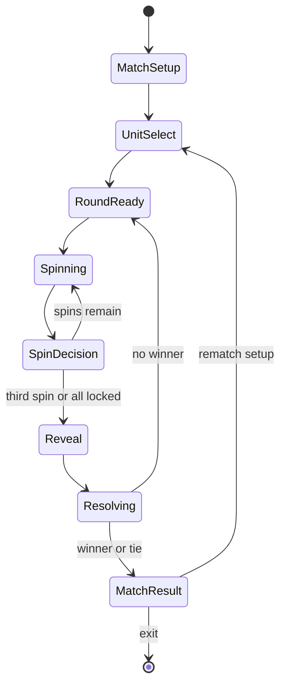

# Match UX Specification

**Document role:** Source of truth for the first playable match experience  
**Status:** Implementation-ready  
**Version:** 0.1.0  
**Companions:** [`RULES_SPEC.md`](RULES_SPEC.md) and [`VISUAL_REFERENCE.md`](VISUAL_REFERENCE.md)  

## 1. Authority and scope

This document defines how a player starts, controls, reads, completes, and restarts one match. It is deliberately engine-agnostic, but concrete enough to implement in Unity or another real-time game engine without outside knowledge.

Document precedence is:

1. `RULES_SPEC.md` controls mechanics, values, randomization, sequencing, and match outcomes.
2. `MATCH_UX_SPEC.md` controls screens, interaction, information visibility, presentation, and input behavior.
3. `VISUAL_REFERENCE.md` illustrates spatial relationships only. It never overrides either specification.

`MUST` and `MUST NOT` are acceptance requirements. `SHOULD` is the expected implementation unless a recorded technical reason prevents it. `MAY` is optional.

### 1.1 First-playable scope

The first player-facing build MUST include:

- one human-versus-AI match;
- visible opponent composition before player confirmation;
- assignment of two units to Channel A/left and Channel B/right;
- five reels, three spins, and per-reel locking;
- the full rules-engine resolution sequence;
- readable Crown, Barrier, energy, XP, rank, and unit statistics;
- win, loss, and tie results;
- rematch and exit;
- keyboard, controller, and pointer input;
- pause, animation acceleration, reduced motion, and non-color state cues;
- deterministic seed and command-log capture for debugging.

The player-facing roster contains only the two original prototype units defined in `RULES_SPEC.md` Section 13.2:

- **Striker**, mechanically using the Warrior values;
- **Caster**, mechanically using the Mage values.

Both units MUST receive original names, silhouettes, icons, effects, and audio before any public release. Reference-game imagery is research material only.

The first playable MUST NOT add campaign progression, collection rewards, towns, dialogue, save/load, online play, more player-facing units, or production effects. A developer-only menu MAY expose all reel tiers, all implemented unit definitions, fixed seeds, and AI profiles.

## 2. Experience requirements

The match should feel like a compact, legible contest rather than a slot machine that resolves invisibly.

The player MUST always be able to answer:

1. What can I do now?
2. How many spins remain?
3. Which reels are locked?
4. What will each symbol contribute?
5. How close is each unit to acting or ranking up?
6. How much Crown HP and Barrier does each side have?
7. Which effect is resolving now?
8. Why did the visible state change?
9. Did the match end, and why?

There is no decision timer. The interface MUST NOT pressure the player to spin or lock within a time limit.

## 3. Application flow



Pause and inspection are overlays, not simulation phases. Opening either overlay MUST NOT advance the simulation, consume a spin, or alter the event queue.

## 4. UX state contract

Only commands listed for the current state are legal. The presentation layer MUST wait for command acceptance before showing a persistent state change.

| State ID | Required display | Legal player actions | Exit condition |
|---|---|---|---|
| `MATCH_SETUP` | Opponent, AI profile, opponent units, rules version; seed and reel tier only in developer mode | Continue, Back/Exit, developer settings | Continue opens unit selection |
| `UNIT_SELECT` | Opponent pair; available player units; empty or assigned A/left and B/right slots; unit descriptions | Navigate, inspect, assign, swap, remove, confirm, back | Two valid units are assigned and confirmed |
| `ROUND_READY` | Full board, round number, both sides' public state, all player reels unlocked, primary `SPIN` prompt | Spin, inspect, pause | Accepted `Spin` command |
| `SPINNING` | Reels in motion; already locked reels stationary; input-blocked board | Accelerate/skip animation, pause | `ReelsSpun` finishes presenting |
| `SPIN_DECISION` | Current faces, locks, spins remaining, live outcome preview | Toggle any reel lock, inspect, spin unlocked reels, pause | Next spin, third-spin auto-finalize, or confirming with all five reels locked (D-028) |
| `AI_COMMIT` | Player result held on screen; neutral “opponent choosing” indicator when needed | Inspect, pause | AI command sequence is complete |
| `REVEAL` | Final faces for both sides; computed symbol totals | Accelerate/skip, pause | Reveal presentation completes |
| `RESOLVING` | Full board, current effect focus, deltas, event log; final reel faces remain auditable | Accelerate/skip, inspect, pause | `RoundEnded` or `MatchEnded` finishes presenting |
| `MATCH_RESULT` | Win/loss/tie, final state, rounds played, rematch and exit actions | Rematch, change units, copy replay data, exit | Chosen action |
| `PAUSED` | Resume, settings, restart match, exit match | Navigate, confirm, back | Resume or confirmed destructive action |

### 4.1 Match setup

The normal first-playable setup uses:

- Standard AI;
- Copper reel tier for both sides (practice); in a world challenge the player brings their best bought wheel and
  the opponent their own (D-033);
- a newly generated seed;
- Striker and Caster as the AI pair.

The opponent pair MUST be visible before the player confirms their units. The normal screen MUST NOT expose future reel faces, PRNG state, AI evaluation weights, or the AI's pending decisions.

Developer mode MAY select:

- explicit seed;
- Copper through Platinum fifth-reel tier;
- Learner, Standard, or Expert AI;
- any registered unit definition;
- forced scenarios used by acceptance tests.

### 4.2 Unit selection

The selection screen MUST show two destination slots:

- **A / Left** with the Channel A symbol;
- **B / Right** with the Channel B symbol.

Selecting a unit assigns it to the first empty slot. Selecting an assigned unit removes it. A focused slot can be replaced or swapped. Confirm remains disabled until both slots contain valid units.

Duplicate unit definitions are prohibited in the first playable. The validation rule MUST live in configuration rather than be hard-coded into the visual component.

Each unit card MUST expose:

- name and role;
- current starting rank, Bronze;
- activation cost;
- Crown and Barrier damage per projectile;
- attack height or direct/support classification;
- number of projectiles;
- a plain-language ability description.

### 4.3 Round start

At the start of every round:

- increment and display the round number;
- unlock all five reels;
- set spins used to zero;
- preserve Crown HP, Barrier, unit rank, XP, and stored energy from the authoritative state;
- focus the `SPIN` action;
- capture the public round-start state that the AI is allowed to evaluate.

No reel face from a prior round should appear actionable. It MAY remain dimly visible until the first spin begins.

### 4.4 Spin and lock behavior

The first spin always rerolls all five reels. Lock controls are unavailable before its result appears.

After spin 1 or spin 2:

- each reel is independently focusable;
- activating a reel toggles its lock;
- a locked reel shows a padlock, a distinct frame, and a stationary state;
- an unlocked reel remains eligible for the next spin;
- the primary action reads `SPIN UNLOCKED REELS`;
- the UI displays both `spins used` and `spins remaining`.

After spin 2, previously locked reels can be unlocked and rerolled.

The third spin automatically finalizes after its animation. With all five reels locked after spin 1 or spin 2, the interface asks for a confirm (D-028): the lever reads LOCK IN and pressing it finalizes early, as the rules allow. Unlocking any reel returns to spinning, so an accidental fifth lock never ends the turn. The normal interface MUST NOT provide an early-finalize control while fewer than five reels are locked.

Lock state changes are commands. The interface MUST update the lock indicator only after `SetReelLock` is accepted.

### 4.5 Live outcome preview

During `SPIN_DECISION`, a non-authoritative preview MUST show:

- total printed Channel A symbols and resulting energy;
- total printed Channel B symbols and resulting energy;
- total Hammers and resulting Barrier;
- XP faces assigned to each unit;
- whether either unit would become ready if the current faces finalized;
- capped or wasted energy/Barrier using a visible overflow marker.

**As built (D-028):** the preview counts **locked reels only**. It shows what the player has committed to, because unlocked reels will spin again. It is drawn on each piece's nameplate as a gem tally (two priming cells, then +1 cells) plus the exact result ("+2 ENERGY", "1 MORE = +1", red "(1 WASTED)"). The podium ring pulses the segments that will fill and shows overflow in red. The wall label reads "WALL a > b (n WASTED)". Ready pieces wear a green READY tag.

The preview MUST use the exact formulas and caps from `RULES_SPEC.md`. It MUST NOT mutate authoritative state, predict attacks beyond the current deterministic result, or imply that a unit will act when an earlier priority effect could delay it. Use wording such as `READY BEFORE RESOLUTION`, not `WILL ATTACK`, when priority interactions can change the outcome.

### 4.6 AI information boundary

The AI uses the same commands and legal reel definitions as the human.

To prevent information leakage:

1. Capture the AI decision input from public state at `ROUND_READY`.
2. The AI may inspect its own rolls as they occur.
3. It MUST NOT inspect the player's current-round faces, lock choices, preview, or final result.
4. Its command sequence may be computed after the human commits for implementation convenience, but must use only the captured legal input.
5. Reveal the AI's final faces only after both sides are committed.

In production play, AI computation SHOULD finish within 500 ms on target hardware. A cosmetic wait MAY bring the visible response to 300–700 ms, but automated tests and reduced-wait settings MUST be able to remove it.

### 4.7 Reveal and resolution

Before resolution begins:

- display both sides' final five faces;
- display their evaluated symbol totals;
- retain the faces until the round is fully resolved;
- clearly move focus from reels to the central action lane.

The presenter consumes the simulation event list in order. It MUST NOT reorder events for dramatic effect. A Crown reaching 0 during resolution MUST be shown at 0, but no victory overlay appears until `MatchEnded`; remaining legal actions continue.

At `RoundEnded`, pause long enough to make the final state readable, then return to `ROUND_READY`. At `MatchEnded`, finish the current event, reconcile visual state, and open `MATCH_RESULT`.

### 4.8 Match result

**World challenges (D-033):** the line under the result reads the stake ("Stake 8" / "Friendly game" / "Played for a
favour"), what changed ("+8 coins", "Crown Tonic used", "you owe a favour") and the purse. Each finished match settles
once; a rematch stakes again and never reuses the charm. Table sounds (spins, locks, lever, hits, Bulwark, rank-up,
result) and table music play through `AudioDirector`; they never affect timing or results.

The result overlay MUST distinguish:

- Victory;
- Defeat;
- Tie.

It MUST show final Crown HP, rounds played, selected units, AI profile, reel tier, and seed. It MUST provide:

- `REMATCH`, same setup with a new seed;
- `CHANGE UNITS`, return to unit selection;
- `COPY REPLAY`, seed plus ordered command log;
- `EXIT`.

Developer mode MAY add `REPLAY SAME SEED`. Normal rematch MUST use a new seed so it cannot be mistaken for deterministic replay.

## 5. Board layout and visual hierarchy

The first playable targets a 16:9 landscape viewport. Design at 1920×1080 reference resolution and verify down to 1280×720. Wider or taller displays should expand decorative margins; the functional board preserves aspect ratio and safe-area placement.

**As built (D-029):** the 1920×1080 interface frame is always fully visible. At 16:9 and wider (PC, iPhone) it scales by height and gets side margins. On narrower screens (iPad 4:3) it scales by width and gets margins above and below. The table camera widens its vertical field of view below 16:9 so the whole table, including the lever and the round dial, stays in view.

```text
OPPONENT REELS
OPPONENT A UNIT      OPPONENT CROWN      OPPONENT B UNIT
                    OPPONENT BARRIER
===================== ACTION LANE =====================
                     PLAYER BARRIER
PLAYER A UNIT         PLAYER CROWN         PLAYER B UNIT
PLAYER REELS + LOCKS + SPIN ACTION
```

The text diagram defines hierarchy, not final art. Use `VISUAL_REFERENCE.md` for representative spatial treatment.

**As built (D-027):**
- **The table:** a full-screen 3D table (`MechanicalTable`) in the source game's style, carved stone, bronze and gold, with original shapes. It follows the hierarchy above, with the reels built into the table.
  - Each reel is an eight-sided drum that shows one face in its window.
  - Each Crown has a gold housing with a two-digit flip counter.
  - Each Barrier is a curved brick wall that rises out of a slot in the table.
  - Each unit stands on a podium ringed by energy segments, with an energy-gem pillar and a stat plaque.
  - Pieces travel out along a carved groove to act and return afterwards.
- **The board is the interface (D-028).** Every piece of match information is a part on the table:
  - **Nameplates** lie in front of each podium: rank badge, name, XP diamonds, crown and wall damage, and the locked-gem energy tally with its result. During actions, a numbered order token appears; before that, a READY tag.
  - The **step sign** sits in the centre plaza. It flips to name the current step: LOCK OR SPIN, OPPONENT, REVEAL, XP, WALL, ENERGY, ACTIONS (action n of m), ROUND OVER. A strip beneath it lights 1 XP > 2 WALL > 3 ENERGY > 4 ACTIONS in turn.
  - The **SPIN lever** is bottom right. Three lamps show spins left, and a plate says what the lever will do: SPIN, SPIN AGAIN, LOCK IN, or HOLD TO SPEED UP. The **round dial** is bottom left.
  - Invisible hit areas over drums, podiums and lever carry focus and clicks. Focus on a piece is drawn as a gold ring on the table.
  - The only screen-space UI: a bottom-left prompt bar of key caps for what can be done now, a short toast for rejections, and round Help (?) and Menu (II) buttons top right.
- **Removed (D-028):** corner unit panels, event log, legend, banner, preview text, on-screen SPIN/speed buttons, and the curved arch inlay in front of each crown.

### 5.1 Required regions

| Region | Placement | Required contents |
|---|---|---|
| Opponent reels | Top center | Five final faces; hidden/covered before reveal |
| Opponent units | Upper left and upper right | Figurine/silhouette, channel, rank, XP, energy/cost, statistics |
| Opponent Crown | Upper center | Current HP and cap |
| Opponent Barrier | Above action lane | Numeric height 0–5 plus segmented/physical representation |
| Action lane | Center | Projectiles, direct effects, bombs, healing, and event focus |
| Player Barrier | Below action lane | Numeric height 0–5 plus segmented/physical representation |
| Player units | Lower left and lower right | Figurine/silhouette, channel, rank, XP, energy/cost, statistics |
| Player Crown | Lower center | Current HP and cap |
| Player reels | Bottom center | Five faces, lock controls, XP markings, focus state |
| Turn controls | Bottom safe area | spins remaining, primary action, pause/help |

### 5.2 Unit podium contract

Every unit presentation MUST include, without opening inspection:

- unit name or unambiguous short label;
- A/left or B/right channel symbol;
- rank as text and visual treatment;
- XP as `current / 6`;
- stored energy as `current / cost`;
- Crown damage;
- Barrier damage;
- attack height, projectile count, or support/direct icon as applicable.

Rank color or material is supplemental. Bronze, Silver, and Gold MUST also appear as text or distinct rank glyphs.

### 5.3 Crown and Barrier contract

Crown health MUST be shown numerically at all times. The table's flip counter shows the current value; values above the normal cap of 10 turn green, and a broken Crown's digits turn red and its crown greys out (D-027). The cap of 10 is stated in Help. *(Superseded: an always-visible `current / normal cap` readout. The creative director asked for the source's style, whose counter shows only the number.)*

Barrier MUST show both:

- a number from 0 to 5;
- five discrete positions or segments.

A Barrier hit removes visible segments at the impact moment. Excess damage MUST NOT visually continue into the Crown. On the table the wall's layers sink back into their slot and knocked-out bricks tumble away; "WALL n" floats beside it.

### 5.4 Reel face contract

Each face MUST encode:

- symbol family: Channel A, Channel B, Hammer, or blank;
- printed quantity: one, two, or three;
- XP status when applicable.

Do not rely on color alone. Channel A and Channel B use different shapes. Quantity is represented by repeated marks, not only a number. XP faces include a star/XP badge in addition to their background treatment.

Locked reels require three simultaneous cues (as built: the padlock and "LOCKED" tag, a red frame on the reel button plus a red clamp that snaps up across the drum window, and the drum staying still):

- padlock glyph;
- changed frame treatment;
- no motion on the next spin.

### 5.5 Inspection and help

Focusing or hovering a unit opens a compact inspection card. It contains the full ability description and current-rank values. An expanded details action MAY show all three rank rows.

A persistent help action MUST expose:

- the symbol-to-resource formula;
- the meaning of XP faces;
- lock/unlock behavior;
- Crown and Barrier targeting;
- rank and bomb progression;
- current input bindings.

Help is available during decision states and pause. Opening it freezes presentation but does not alter state.

## 6. Input contract

Gameplay code consumes abstract actions, not device-specific keys.

| Abstract action | Keyboard default | Controller default | Pointer/touch equivalent |
|---|---|---|---|
| Navigate | Arrow keys / WASD | D-pad / left stick | Hover or direct selection |
| Confirm / primary | Enter / Space | South face button | Primary click/tap |
| Back | Escape | East face button | Back button |
| Toggle reel lock | Enter / Space on focused reel | South face button | Click/tap reel |
| Focus next / previous | Tab / Shift+Tab | Bumpers | Direct selection |
| Inspect | I | West face button | Hover or info button |
| Help | H | View/Select | Help button |
| Accelerate presentation | Hold Space | Hold South face button | Hold skip control |
| Pause | Escape outside overlays | Menu/Start | Pause button |

Bindings MAY be remapped. Display prompts based on the most recently used device without changing focus.

### 6.1 Focus behavior

- Every interactive element MUST have a visible focus indicator.
- Focus MUST never become trapped or disappear when the active device changes.
- When entering `ROUND_READY`, focus `SPIN`.
- When entering `SPIN_DECISION`, focus the first unlocked reel; the primary spin action remains one navigation step away.
- Reel navigation proceeds left to right and wraps only if the accessibility setting permits wraparound.
- When an element becomes disabled, focus moves to the nearest legal action.
- Modal overlays trap focus until closed.
- Closing an overlay returns focus to the element that opened it.

Pointer hover MUST NOT dispatch gameplay commands. A click/tap is required.

## 7. Presentation and animation contract

The authoritative simulation may finish immediately. The presenter maintains a separate visual state and consumes immutable events one at a time.

For each event:

1. read the event's before-state and after-state data;
2. stage the source and target;
3. play anticipation;
4. apply the visible state delta at the impact marker;
5. show numeric delta and status text;
6. settle into the after-state;
7. advance to the next event.

Animations MUST never issue gameplay commands or mutate `MatchState`.

### 7.1 Event presentation mapping

| Simulation event | Minimum visible response |
|---|---|
| `ReelsSpun` | Only unlocked reels move; each stops on its authoritative face |
| `ReelLockChanged` | Lock glyph and frame change after acceptance |
| `SpinFinalized` | Reels settle and controls disable |
| `PanelXpGranted` | XP marker travels/highlights; `+1 XP` appears per XP face |
| `UnitRankedUp` | Rank label and podium treatment change; new values refresh |
| `BarrierBuilt` | Segments appear; `+N` shows actual, not attempted, gain |
| `EnergyGranted` | Energy track advances; capped waste is identified |
| `EnergyDelayed` | Target track retreats; source and target are highlighted |
| `UnitActivated` | Unit rises/highlights and action rod resets at the correct event point |
| `ProjectileResolved` | Projectile follows its height/lane; impact identifies Crown or Barrier |
| `CrownDamaged` | HP changes at impact; no premature result overlay |
| `BarrierDamaged` | Segments and number decrease; no Crown spill animation |
| `CrownHealed` | HP increases with cap respected |
| `BombLaunched` | Bomb clearly bypasses Barrier and impacts Crown |
| `RoundEnded` | Resolution focus clears; next-round prompt appears |
| `MatchEnded` | Final state settles, then result overlay opens |

If an event attempts a change larger than the actual capped change, display the actual delta and optionally label the remainder `WASTED` or `CAPPED`.

### 7.2 Timing budget

Normal presentation SHOULD use:

- 350–700 ms for a reel spin after initial anticipation;
- 150–350 ms for XP, energy, lock, and small state changes;
- 350–650 ms for attacks, healing, Barrier building, rank-ups, and bombs;
- 250–500 ms for round transition;
- no more than 8 seconds for a typical full resolution sequence.

**As built (D-028):** at the creative director's request, the round is paced as a readable sequence rather than fit into 8 seconds. Each resolution step (XP, wall, energy, actions) opens with a 0.8 s beat, and resolution events run 1.6x their base duration. The opponent "thinks" for 0.8 s and the reveal holds for 1.1 s. Tab / RB skips a step and holding accelerate fast-forwards, so a player who knows the game is never slowed down.

These are timing bounds, not permission to merge or reorder events.

### 7.3 Acceleration, skip, and reduced motion

- Holding the accelerate action for 350 ms runs the current and remaining presentation at 4× speed.
- Releasing it returns to normal speed at the next event boundary.
- A developer-only `SKIP ALL` completes every remaining event immediately in order.
- **Skip step (D-028):** during presentation, the next-element action (Tab / RB) presents every remaining event of the current step instantly, in order, then continues at normal pace with the next step.
- Reduced Motion replaces large travel, shake, zoom, and flashes with short fades, highlights, and numeric deltas.
- Skipping or reducing animation MUST produce the identical final visual state and event log.
- Presentation acceleration MUST NOT alter AI think time used by deterministic tests.

Pause freezes the presenter at its current visual point. Resume continues the same event; it does not restart or skip it.

### 7.4 Audio and haptics

Audio and haptics are supportive only. No rule or state may be communicated exclusively through them.

Distinct cues SHOULD exist for:

- reel stop;
- lock/unlock;
- unit ready;
- Crown hit;
- Barrier hit;
- rank-up;
- bomb;
- match result.

Master, music, effects, and haptic controls MUST be independently adjustable if those systems are present.

## 8. Accessibility requirements

The first playable MUST include:

- keyboard-only operation;
- controller-only operation;
- pointer operation;
- remappable controls or centralized bindings ready for remapping;
- reduced-motion setting;
- screen shake toggle, defaulting to low rather than strong;
- separate text labels for all color-coded states;
- high-contrast focus and lock indicators;
- scalable UI at 100%, 125%, and 150%;
- captions/status text for meaningful audio cues;
- no rapid flashing above common accessibility thresholds;
- no timed decisions.

At 1280×720 and 150% UI scale, essential statistics and the active control MUST remain visible without overlap. Inspection cards may scroll.

Semantic labels for assistive technology SHOULD follow this pattern:

```text
Reel 3, unlocked, Channel A times two, grants XP to left unit.
Player Striker, Silver rank, 4 of 6 XP, 2 of 3 energy.
Opponent Barrier, height 3 of 5.
Spin unlocked reels, 1 spin remaining.
```

## 9. Feedback and error handling

Rejected commands MUST leave authoritative and visual state unchanged.

The rules controller returns a structured rejection:

```text
CommandRejected
  commandId
  reasonCode
  humanReadableKey
  currentPhase
```

Required reason codes include:

- `WRONG_PHASE`
- `SIDE_NOT_CONTROLLED`
- `FIRST_SPIN_REQUIRED`
- `NO_SPINS_REMAINING`
- `INVALID_REEL_INDEX`
- `REEL_ALREADY_IN_STATE`
- `MATCH_ALREADY_ENDED`
- `UNIT_SELECTION_INCOMPLETE`
- `DUPLICATE_UNIT_NOT_ALLOWED`
- `CONFIG_INVALID`

For a recoverable rejection, the UI MUST:

1. keep focus on the attempted control;
2. show a concise status message;
3. play a non-disruptive invalid-action cue if audio is enabled;
4. avoid opening a blocking dialog.

Examples:

- `Spin all reels before locking.`
- `No spins remain; this result is final.`
- `Choose two different units.`

Configuration failures and presenter/simulation desynchronization are not recoverable gameplay errors. In development builds, stop the match, preserve the seed and command log, and show diagnostic details. In a player build, return safely to setup with a general error identifier; never continue from a state known to be inconsistent.

## 10. Pause, restart, and exit

Pause is available during every match state except an already open modal. It freezes presentation and blocks simulation commands.

`RESTART MATCH` and `EXIT MATCH` require confirmation after a match has begun because unsaved progress will be discarded. The confirmation states exactly what happens:

- Restart: same setup with a new seed;
- Exit: return to the calling screen and discard the current match.

Mid-match save and resume are outside first-playable scope. Closing the application during a match may discard it.

## 11. UI architecture contract

The implementation MUST separate four layers:

```text
Input Adapter -> Match Controller -> Deterministic Simulation
                                      |
                                      v
                              Events + Snapshots
                                      |
                                      v
                                  Presenter
```

- **Input Adapter:** converts devices into abstract UX actions.
- **Match Controller:** validates the UX phase and dispatches simulation commands.
- **Deterministic Simulation:** owns all authoritative rules state and events.
- **Presenter:** owns animation, focus, audio, tooltips, and visual interpolation.

The presenter MUST render from a read-only view model. UI components MUST NOT directly change HP, Barrier, XP, energy, rank, reel faces, locks, round number, winner, or RNG state.

### 11.1 Required read model

```text
MatchViewModel
  uxState
  roundNumber
  spinsUsed
  spinsRemaining
  canSpin
  canToggleLocks
  resolutionEventLabel
  playerSide
  opponentSide
  playerReels[5]
  opponentReels[5]
  opponentReelsRevealed
  focusedElementId
  settings

SideView
  crownCurrent
  crownCap
  barrierCurrent
  units[2]

UnitView
  id
  displayName
  channel
  rank
  xpCurrent
  xpThreshold
  energyCurrent
  energyCost
  crownDamage
  barrierDamage
  attackHeights[]
  projectileCount
  abilityTextKey
  readyState

ReelView
  index
  faceId
  revealed
  locked
  symbols[]
  xpChannel
  focusable
```

At the end of each event and at `RoundEnded`/`MatchEnded`, compare the presenter's completed visual state against the corresponding authoritative snapshot in development builds. A mismatch fails loudly and preserves replay data.

## 12. Configuration example

The following illustrates the minimum data boundary. Names and exact serialization may change, but the same information and validation must exist.

### 12.1 Match configuration

```json
{
  "rulesVersion": "0.1.0",
  "seed": 184467,
  "allowDuplicateUnits": false,
  "player": {
    "controller": "human",
    "reelSetId": "copper",
    "units": ["striker", "caster"]
  },
  "opponent": {
    "controller": "ai_standard",
    "reelSetId": "copper",
    "units": ["striker", "caster"]
  }
}
```

### 12.2 Prototype unit definitions

```json
[
  {
    "id": "striker",
    "channelCompatibility": ["A", "B"],
    "action": { "type": "projectiles", "heights": [1] },
    "ranks": {
      "bronze": { "energyCost": 3, "crownDamage": 3, "barrierDamage": 3 },
      "silver": { "energyCost": 3, "crownDamage": 5, "barrierDamage": 5 },
      "gold":   { "energyCost": 3, "crownDamage": 7, "barrierDamage": 5 }
    }
  },
  {
    "id": "caster",
    "channelCompatibility": ["A", "B"],
    "action": { "type": "projectiles", "heights": [1, 6] },
    "ranks": {
      "bronze": { "energyCost": 5, "crownDamage": 2, "barrierDamage": 2 },
      "silver": { "energyCost": 4, "crownDamage": 3, "barrierDamage": 3 },
      "gold":   { "energyCost": 4, "crownDamage": 3, "barrierDamage": 5 }
    }
  }
]
```

Damage values for the Caster apply to each projectile. The simulation, not the UI, expands the two heights into sequential attacks.

### 12.3 Reel face definition

```json
{
  "id": "reel_1",
  "facesInOrder": [
    { "symbols": { "A": 1 } },
    { "symbols": { "B": 1 } },
    { "symbols": { "A": 1 } },
    { "symbols": { "A": 1 }, "xpChannel": "A" },
    { "symbols": { "B": 1 } },
    { "symbols": { "hammer": 1 } },
    { "symbols": { "B": 2 }, "xpChannel": "B" },
    { "symbols": { "hammer": 1 } }
  ]
}
```

### 12.4 Configuration validation

Before entering `MATCH_SETUP`, validation MUST reject:

- unknown rules version;
- seed outside the supported integer representation;
- anything other than two sides, two units per side, five reels, or eight faces per reel for this rules version;
- unknown controller, unit, reel set, action, rank, face, symbol, or channel IDs;
- missing Bronze/Silver/Gold rows;
- nonpositive energy cost;
- negative damage, healing, delay, XP, HP, or Barrier values;
- duplicate units when disabled;
- player and opponent reel tiers that differ in the first playable;
- a face containing both Channel A XP and Channel B XP;
- data that cannot be rendered by the registered presenter.

Warnings are not enough for invalid deterministic content. The match MUST refuse to start.

## 13. Telemetry and replay data

Use the telemetry listed in `RULES_SPEC.md` Section 18. UX telemetry additionally records:

- time spent in each decision state;
- focus and input device changes;
- lock/unlock sequence;
- help and inspection use;
- rejected command reason codes;
- normal versus accelerated presentation time;
- reduced-motion and UI-scale settings;
- restart, rematch, and exit points.

Do not use telemetry to change reel outcomes or AI legality.

`COPY REPLAY` MUST produce a compact, text-safe payload containing:

```text
rulesVersion
contentHash
seed
side configurations
ordered accepted commands
final authoritative state hash
```

Rejected commands MAY be appended as diagnostics but do not belong to the deterministic command stream.

## 14. End-to-end acceptance scenarios

These scenarios supplement, not replace, the rules-engine tests in `RULES_SPEC.md`.

### 14.1 Setup and selection

- Opponent units are visible before player confirmation.
- Confirm is disabled with zero or one assigned unit.
- Duplicate assignment is rejected without losing the valid slot.
- Swapping A and B visibly updates channel symbols and subsequent energy routing.
- Starting a match initializes both sides correctly and reaches `ROUND_READY`.

### 14.2 Spin interaction

- First spin moves all five reels.
- A locked reel remains visually and authoritatively unchanged on spin 2.
- An unlocked former lock can change on spin 3.
- Locking all five after spin 1 asks for a confirm; pressing the lever commits (D-028).
- Spin 3 commits automatically.
- Preview totals match final evaluation when no priority effect changes readiness.
- Mouse, keyboard, and controller can each complete the entire spin phase.

### 14.3 Resolution readability

- XP, rank-up, Barrier, energy, action, damage, bomb, and round-end events appear in authoritative order.
- Every numeric state change has a visible cause and delta.
- Multi-projectile impacts update Barrier between projectiles.
- No-overflow Barrier damage produces no Crown-hit presentation.
- Crown at 0 does not open a result before the final check.
- Tie resolution produces a Tie result, not Victory or Defeat.
- Accelerated and reduced-motion presentation reach the same final visual and authoritative state.

### 14.4 AI boundary

- The AI never receives the player's current-round faces or locks in its decision input.
- Replaying the same seed and accepted commands reproduces AI rolls, choices, events, and result.
- Changing presentation speed does not change AI choices or RNG consumption.

### 14.5 Pause and errors

- Pause during a reel spin resumes the same spin.
- Pause during a projectile resumes the same event without double-applying damage.
- Invalid commands do not mutate state or strand focus.
- Restart and exit require confirmation after match start.
- A forced presenter mismatch preserves replay information and stops rather than continuing incorrectly.

### 14.6 Accessibility

- The match is completable without a pointer.
- The match is completable without audio.
- Lock, XP, rank, channel, ready, and result states remain distinguishable in grayscale.
- Reduced Motion removes large movement and shake without hiding event order.
- At 1280×720 and 150% scale, no essential active-state information overlaps or leaves the safe area.

## 15. First-playable completion gate

The first playable is complete only when all of the following are true:

- A fresh launch reaches setup without editor intervention.
- A player with no prior knowledge can inspect the two units and begin a valid match.
- One full match can be completed using keyboard, controller, or pointer.
- Every required state has an implemented empty, focused, disabled, active, and error treatment where applicable.
- All nine board-anatomy items in `VISUAL_REFERENCE.md` are readable.
- All accepted commands pass through the deterministic simulation API.
- The presenter consumes events without owning rules state.
- Same seed and command log reproduce the same match.
- All rules automated tests pass.
- All end-to-end scenarios in Section 14 pass.
- No reference-game art, character names, UI assets, effects, music, or audio ship in the build.
- Replay data can be copied from the result and from a development error.
- The build runs at 60 frames per second at 1920×1080 on the agreed baseline machine, excluding deliberate frame caps.
- No crash, dead end, unreadable control, or known state desynchronization remains.

When this gate passes, stop at the human playtest gate in `RULES_SPEC.md` Section 13.3. Do not expand content until the creative director plays the match and approves continuation.

## 16. Recommended implementation order

1. Load and validate configuration.
2. Connect the deterministic simulation to a command-line or test controller.
3. Build the read-only match view model.
4. Render a static board with every required statistic.
5. Implement setup and unit assignment.
6. Implement spin, focus, lock, preview, and finalization states.
7. Add AI through the same command API and enforce its information boundary.
8. Implement event-queue presentation with instant placeholder transitions.
9. Add result, rematch, replay capture, pause, and error states.
10. Add normal, accelerated, and reduced-motion presentation.
11. Complete input-device passes and end-to-end acceptance scenarios.
12. Package the first playable and stop for human playtest.

